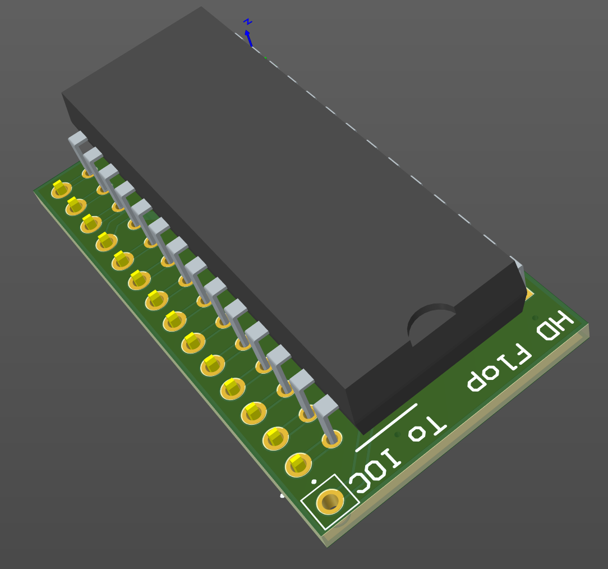
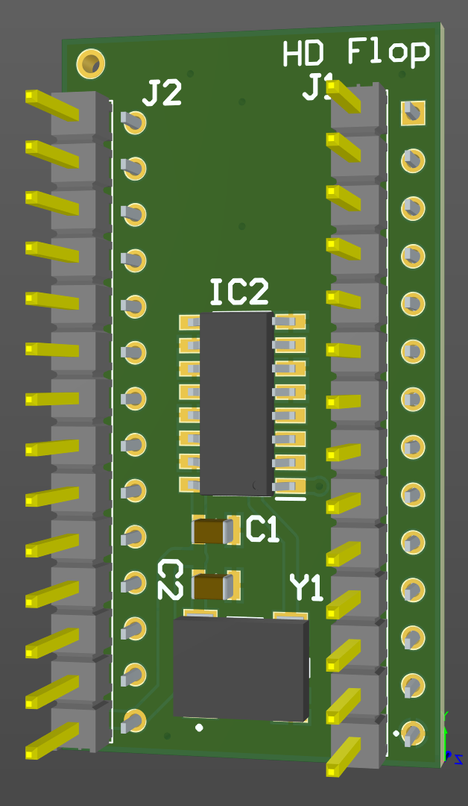

# HD 1772 floppy

April 2023

This is my implementation of an overclocker / clock switcher for the WDC 1772 floppy controller, to allow HD floppies.
This is a direct implementation of the design by Pasi Juppo / Boris Leppin et al - I've merely entered it in to Altium and generated my own PCB layout.  The design uses SMT parts, all hidden beneath the board, so as to be as compact as possible.

This has not yet been manufactured / tested!

## Licence

No warranty is provided, and this work is used at your own risk.  

Licenced as CC BY-SA 3.0

Copyright 2023 Ian Jeffray

